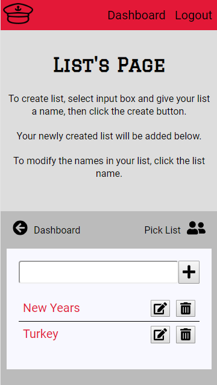
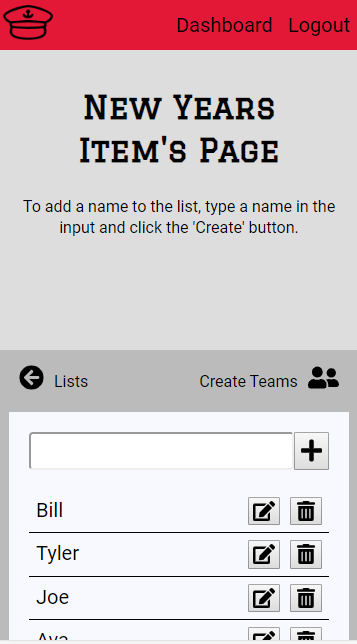
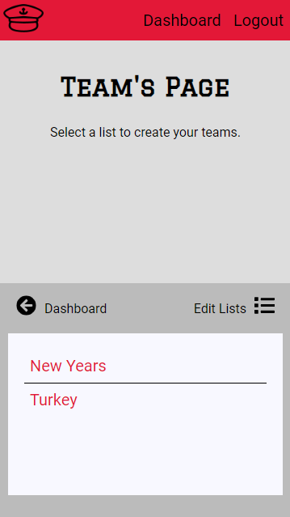
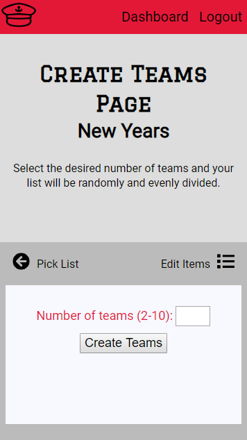

# Captains
Captains provides you the ability to create a list of names, and from there you can create a set number of teams by randomly assigning the names in you list to those teams.
[Live version](https://captains.now.sh/)

## Description
There's two primary functions to Captains: Lists and Teams.

### Lists
The list functionality is where lists can be created. Once a list is created, you can then add items to the list by clicking on the list's name on the Lists page. When the list name is clicked on, the user will be taken to the the Names page. Once there the user can add items/names to that list. 

Lists Page

Names Page

There are edit and delete capabilities to both the lists and list items. 

A user can only modify their lists and their list's items from the List and Names pages. 

------------------------------------------

### Teams
Once the user has a list with all of the desired names on that list, they can then can create their teams. 

On the Teams List page, the user can select a list to use. The user can not add, edit or delete the lists from here that can only be down from the Lists page. 

Teams List Page

Once a list has been chosen, the user will be taken to the Team page. From there the user selects their desired number of teams and clicks the create teams button.

Team Page

A specified number of teams will be created with the names in the chosen list randomly assigned to the teams. 

## Dependencies
### react-modal
The react-modal dependency is used as a way to edit the names of lists and list items. Here is the [link](https://reactcommunity.org/react-modal/) for the documentation of this dependency. 

## API
A link to the repo for the API can found [here](https://github.com/denver92john/captains-api).

## Roadmap
The next functionality to be added to Captains would be to provide the user the ability to create a playoff bracket after a set of teams is created. 

## Technologies Used
*   React